# Quantum Tunneling

[](https://www.python.org/)
[](https://numpy.org/)
[](https://scipy.org/)
[](https://matplotlib.org/)
[](LICENSE)

Reproducible one-dimensional quantum-tunneling simulations based on numerical solutions of the time-dependent Schrödinger equation (TDSE), with exact transfer-matrix references, numerical-convergence tests, resonant double-barrier transport, wave-packet dynamics, tunneling lifetimes, and double-well level splitting.

The repository is designed as a compact computational-physics research workflow: the numerical solver lives in `tdse_lib.py`, the complete simulation and validation campaign is orchestrated by `run_sims.py`, figures are produced by `plot_figures.py`, and selected derived results are stored in `results.json`.

## Overview

The project studies quantum tunneling in one spatial dimension for a single particle with constant mass equal to the electron mass. Energies are expressed in eV, positions in nm, and time in fs. The kinetic-energy coefficient is implemented as

\[
\frac{\hbar^2}{2m_e} = 0.0380998212\;\mathrm{eV\,nm^2},
\]

with \(\hbar = 0.6582119569\;\mathrm{eV\,fs}\).

Two complementary model systems are treated:

- **Double barrier:** resonant and off-resonant transmission through a finite piecewise-constant barrier structure.
- **Double well:** coherent population transfer, level splitting, tunneling period, and comparison with a WKB estimate.

## What the repository implements

### 1. TDSE spatial discretization

`tdse_lib.py` constructs the Hamiltonian using sparse finite-difference approximations to the second derivative. Central stencils of **2nd, 4th, 6th, and 8th order** are available, together with Dirichlet boundary conditions.

### 2. Time propagation

Time evolution is performed through a sparse rational approximation to the exponential propagator. The implementation constructs the matrix pair corresponding to the truncated exponential series and factorizes the left-hand matrix once before repeated propagation steps.

### 3. Gaussian wave packets

The code provides normalized Gaussian wave packets with configurable position, width, and wave number, allowing scattering and tunneling dynamics to be studied directly in the time domain.

### 4. Complex absorbing potentials

A quadratic complex absorbing potential (CAP) can be applied near the simulation boundaries to suppress artificial reflections from the finite numerical domain.

### 5. Exact transmission reference

For piecewise-constant potentials, `transmission_exact()` evaluates the reference transmission coefficient using a transfer-matrix formulation. The TDSE results are compared directly against this reference solution.

### 6. Double-barrier resonances

For the default barrier geometry,

- barrier height \(V_0 = 1.0\) eV,
- barrier width \(w = 0.5\) nm,
- central well width \(d = 0.5\) nm,

an exact transmission resonance occurs near \(E_r = 0.4366\) eV. The workflow also examines an off-resonant case at \(E = 0.70\) eV and a higher-energy resonance.

### 7. Parameter sweeps

The workflow evaluates how transmission changes with:

- barrier width,
- barrier height,
- numerical grid spacing, and
- finite-difference order.

### 8. Double-well tunneling

The double-well model is used to calculate the lowest eigenstates, tunnel splitting, population oscillations, and tunneling period. The numerical results are compared with both a spectral reference and a WKB estimate.

### 9. Publication-oriented figures

`plot_figures.py` generates eight figures covering the potential profiles, numerical validation, wave-packet dynamics, transmission spectrum, resonance lifetime, parameter sweeps, double-well tunneling, and three-dimensional probability-density surfaces.

## Numerical workflow

```mermaid
flowchart LR
    A[Define grid and potential] --> B[Build sparse Hamiltonian]
    B --> C[Build TDSE propagator]
    C --> D[Propagate Gaussian wave packet]
    D --> E[Measure norm, R, T and local probabilities]
    E --> F[Compare with exact transfer-matrix reference]
    F --> G[Convergence and parameter sweeps]
    G --> H[Store results]
    H --> I[Generate figures]
```



## Mathematical model

The simulations solve the one-dimensional time-dependent Schrödinger equation

\[
i\hbar\frac{\partial \Psi(x,t)}{\partial t}
=
\left[-\frac{\hbar^2}{2m_e}\frac{\partial^2}{\partial x^2}+V(x)\right]\Psi(x,t).
\]

The probability density is

\[
\rho(x,t)=|\Psi(x,t)|^2,
\]

and integrated probabilities are evaluated numerically as

\[
P_\Omega(t)=\int_\Omega |\Psi(x,t)|^2\,dx.
\]

For scattering calculations, transmission and reflection are obtained from time-domain probe signals and compared with the exact piecewise-constant transfer-matrix result.

## Repository structure

```text
Quantum_tunneling/
├── tdse_lib.py              # Reusable numerical TDSE library
├── run_sims.py              # Full simulation and validation workflow
├── plot_figures.py          # Publication-style figure generation
├── results.json             # Compact numerical summary of key results
├── figures/                 # Generated figure outputs (PDF)
├── LICENSE                  # MIT License
└── README.md                # Project documentation
```

## Requirements

The code uses Python 3 and the following scientific Python packages:

```text
numpy
scipy
matplotlib
```

The standard-library modules used by the workflow include `json`, `pickle`, `time`, `sys`, `traceback`, and `os`.

A `requirements.txt` file is not currently included, so the dependencies should be installed explicitly in a dedicated environment.

## Installation

A minimal virtual-environment setup is:

```bash
python3 -m venv .venv
source .venv/bin/activate
python -m pip install --upgrade pip
python -m pip install numpy scipy matplotlib
```

Then clone the repository and enter the project directory:

```bash
git clone https://github.com/Om-Physics/Quantum_tunneling.git
cd Quantum_tunneling
```

## Running the simulations

The complete workflow is launched with:

```bash
python run_sims.py
```

By default, the script runs the seven analysis sections:

```text
sec0  resonance and exact reference calculations
sec1  spatial and temporal numerical validation
sec2  complex absorbing potential characterisation
sec3  transmission spectrum and parameter sweeps
sec4  grid/stencil convergence of scattering
sec5  double-barrier wave-packet dynamics and lifetime
sec6  double-well tunneling dynamics and splitting
```

Individual sections can be run selectively, for example:

```bash
python run_sims.py sec0
python run_sims.py sec1 sec2
python run_sims.py sec5 sec6
```

The simulation driver writes/updates:

```text
results.pkl     # full numerical objects used by plot_figures.py
results.json    # compact scalar/array summary suitable for inspection
```

## Generating figures

After the simulation workflow has produced `results.pkl`, run:

```bash
python plot_figures.py
```

To generate selected figures only:

```bash
python plot_figures.py fig1 fig4 fig6
```

The figure script writes PDF and PNG versions into `figures/`. The repository currently tracks the publication-style PDF figures.

### Reproducibility note

`plot_figures.py` currently loads `results.pkl` directly. The repository root contains `results.json`, but `results.pkl` is not listed in the current committed root tree. Therefore, a fresh checkout should run `python run_sims.py` before attempting to regenerate the figures.

## Key validation results

The committed `results.json` records the following representative checks from the current workflow:

| Quantity | Result |
|---|---:|
| Production-grid maximum norm drift | `3.21 × 10⁻⁷` |
| TDSE vs exact transmission RMS error | `2.30 × 10⁻³` |
| Maximum transmission absolute error | `2.37 × 10⁻²` |
| Maximum `T + R - 1` deviation | `6.07 × 10⁻³` |
| Lowest double-barrier resonance energy | `0.43662 eV` |
| Resonance width \(\Gamma\) | `0.02172 eV` |
| Exact resonance lifetime \(\hbar/\Gamma\) | `30.30 fs` |
| Double-well eigenvalue splitting | `0.03884 eV` |
| Double-well TDSE splitting | `0.03883 eV` |
| Double-well WKB estimate | `0.03410 eV` |
| Double-well tunneling period | `106.47 fs` |

For the resonant wave-packet run, the final transmitted probability is approximately **0.3822**, compared with an energy-weighted exact expectation of **0.3888**. The off-resonant case gives approximately **0.01646** transmission, close to the corresponding exact expectation of **0.01650**.

The stored CAP-characterisation values also show very small residual probability after boundary absorption for higher incident wave number, with residual norms of approximately `2.86 × 10⁻²`, `5.47 × 10⁻⁵`, and `7.57 × 10⁻⁸` for the tested wave numbers `1.5`, `3.0`, and `5.0`.

## Figures

| Figure | Description | File |
|---|---|---|
| 1 | Potentials and low-lying double-well states | [`fig1_potentials.pdf`](figures/fig1_potentials.pdf) |
| 2 | Spatial/temporal convergence and norm preservation | [`fig2_validation.pdf`](figures/fig2_validation.pdf) |
| 3 | Double-barrier resonant and off-resonant wave-packet dynamics | [`fig3_db_dynamics.pdf`](figures/fig3_db_dynamics.pdf) |
| 4 | Transmission spectrum, resonance, and lifetime | [`fig4_resonance.pdf`](figures/fig4_resonance.pdf) |
| 5 | Barrier-width and barrier-height transmission sweeps | [`fig5_sweeps.pdf`](figures/fig5_sweeps.pdf) |
| 6 | Double-well probability transfer and two-level comparison | [`fig6_doublewell.pdf`](figures/fig6_doublewell.pdf) |
| 7 | Tunnel splitting versus central barrier height | [`fig7_splitting.pdf`](figures/fig7_splitting.pdf) |
| 8 | Three-dimensional probability-density surfaces | [`fig8_surfaces.pdf`](figures/fig8_surfaces.pdf) |

## Interpretation of the main results

The numerical campaign is useful for demonstrating several standard tunneling phenomena in a controlled one-dimensional setting:

1. **Resonant enhancement:** the double barrier supports a pronounced transmission resonance near `0.4366 eV`, producing much larger transmission than the off-resonant case.
2. **Barrier sensitivity:** transmission decreases strongly as the barrier width and/or height are increased, while the double-barrier geometry can exhibit resonant features that are absent from a single barrier.
3. **Wave-packet dynamics:** the resonant packet temporarily accumulates probability in the double-barrier structure before escaping, enabling a direct time-domain interpretation of the resonance lifetime.
4. **Double-well oscillations:** localized initial states oscillate between the wells. The oscillation period is controlled by the lowest-energy splitting, \(T \approx h/\Delta E\).
5. **WKB comparison:** the semiclassical estimate captures the qualitative dependence of the double-well splitting on barrier height, while the numerical eigenvalue calculation provides the reference for the finite model used here.

## Important model conventions

- **Dimension:** 1D position coordinate \(x\).
- **Mass:** constant electron mass \(m_e\).
- **Energy unit:** eV.
- **Length unit:** nm.
- **Time unit:** fs.
- **Boundary treatment:** finite numerical box with Dirichlet discretization and optional CAP for scattering dynamics.
- **Scattering reference:** piecewise-constant transfer-matrix solution for the same-mass problem.
- **Wave packets:** Gaussian initial states.
- **Numerical orders:** 2nd, 4th, 6th, and 8th spatial finite-difference stencils; propagator truncation orders are varied in the validation campaign.

## Scope and limitations

This repository is intended as a controlled computational study of one-dimensional single-particle tunneling. It is **not** a full quantum-transport package and does not model multidimensional geometries, many-body interactions, spin dynamics, phonon coupling, environmental decoherence, or material-specific electronic band structures.

The exact transfer-matrix comparison is available for the piecewise-constant model potentials used by the workflow. The numerical agreement should therefore be interpreted relative to these benchmark systems and the chosen discretization, time step, finite domain, and absorbing-boundary parameters.

## Good practice for extending the project

For reproducible extensions, keep the physical parameters and numerical settings explicit in the driver script, preserve the exact-reference comparisons where available, report grid/time-step convergence, and store compact summary values in JSON alongside any large intermediate objects.

For a stronger software-release structure, the project would benefit from adding a `requirements.txt` or `pyproject.toml`, a small automated test suite, and optionally a `CITATION.cff` file.

## License

This project is distributed under the [MIT License](LICENSE).

Copyright (c) 2025 Omjha369.

## Repository

Source code: https://github.com/Om-Physics/Quantum_tunneling
